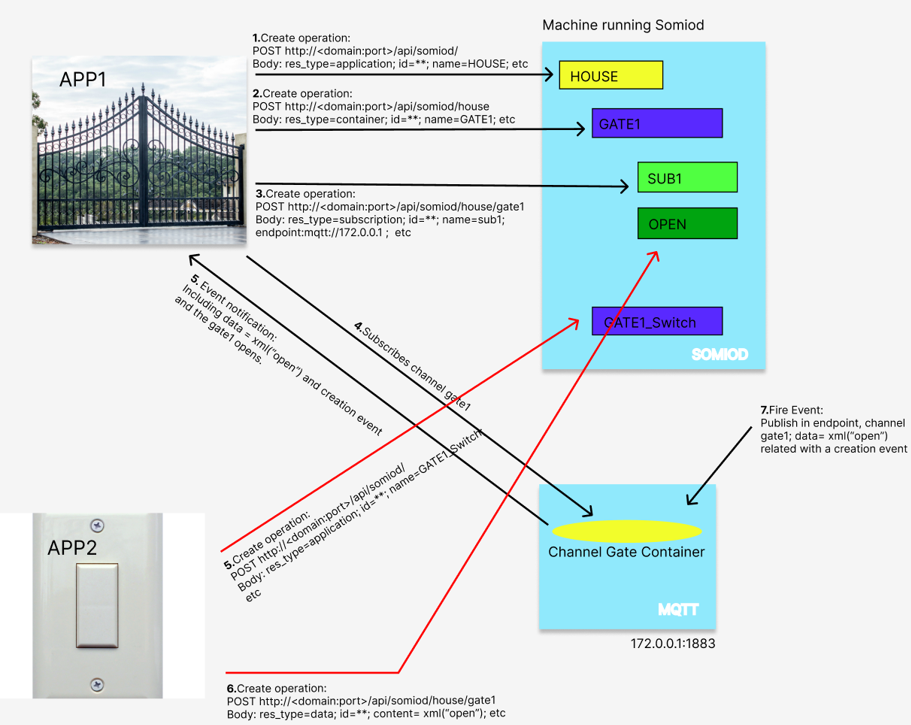

# SOMIOD - Service Oriented Middleware for Interoperability and Open Data

**SOMIOD** is a middleware solution designed to address the *"SILO OF THINGS"* challenge in the Internet of Things (IoT) by standardizing data usage across applications. It enables interoperability between devices and systems through a **REST API** and **MQTT message broker**, simplifying IoT integration and development.


## 📜 Overview

The IoT ecosystem often suffers from fragmentation, where devices cannot easily share data due to different communication protocols and formats. SOMIOD solves this by:

- Providing a **RESTful API** for consistent data access and manipulation.
- Enabling communication between applications through an **MQTT Message Broker**.
- Supporting resource creation and subscription-based notifications.
- Promoting standardization to simplify development and encourage collaboration.


## 🏗 Architecture

**Main components:**
1. **SOMIOD REST API**
   - Handles `GET`, `POST`, `PUT`, and `DELETE` requests.
   - Connects applications to the database and enforces uniform data handling.

2. **Application A**
   - Creates *applications*, *containers*, and *subscriptions*.
   - Receives notifications when data changes.
   - Example: A gate controller that opens/closes based on data messages.

3. **Application B**
   - Creates *containers* and *data* resources.
   - Sends data to trigger actions in subscribed applications.

4. **MQTT Message Broker**
   - Manages real-time communication between applications.
   - Enables publish/subscribe data sharing.


## 🚀 Features

- **RESTful API** supporting:
  - Applications
  - Containers
  - Data
  - Subscriptions
- **MQTT-based communication** for efficient data exchange.
- **Example test cases**:
  - App A acts as a gate receiver.
  - App B sends "open" or "close" commands.


## 📡 API Endpoints

**Application resource**
```http
GET     /api/somiod
POST    /api/somiod
PUT     /api/lighting
DELETE  /api/somiod/{appName}
```

**Container resource**
```http
GET     /api/somiod/{appName}
POST    /api/somiod/{appName}
PUT     /api/somiod/{appName}/{containerName}
DELETE  /api/somiod/{appName}/{containerName}
```

**Data resource**
```http
GET     /api/somiod/{appName}/{containerName}/data
POST    /api/somiod/{appName}/{containerName}
DELETE  /api/somiod/{appName}/{containerName}/{dataName}
```

**Subscription resource**
```http
GET     /api/somiod/{appName}/{containerName}/{subscriptionName}
POST    /api/somiod/{appName}/{containerName}
DELETE  /api/somiod/{appName}/{containerName}/{subscriptionName}
```


## 📦 Example XML Bodies

**Create Application**
```xml
<application>
    <name>gate</name>
</application>
```

**Create Container**
```xml
<container>
    <name>door</name>
</container>
```

**Send Data**
```xml
<data>
    <content>Open</content>
</data>
```

**Create Subscription**
```xml
<subscription>
    <name>Sub1</name>
    <endpoint>mqtt://127.0.0.1</endpoint>
    <eventType>creation</eventType>
</subscription>
```


## 🔮 Future Work

- Support for more device types and protocols.
- Enhanced security mechanisms for data integrity and confidentiality.
- Broader scalability for larger IoT ecosystems.


## 🏛️ Architecture Diagram




## 📅 Project Details

- **Developed by:** 
  - Gonçalo Francisco (Goncalofrancisco), 
  - Joel Bastos (joelsb9), 
  - Pedro Alfaiate (pedro-alfaiate22), 
  - Tiago Batista (tiagobaptista1), 
  - Tiago Cabecinhas (Tcabecinhas)
  
- **Advisers:** 
  - Marisa Maximiano, 
  - Nuno Costa, 
  - Humberto Ferreira
  
- **Institution:**
  Polytechnic of Leiria, Portugal

- **Course:**
  Systems Integration

- **Bachelor’s:**
  Software Engineering

- **Project Duration:**
  Approximately 3 months


## 📄 License

This project is provided for academic purposes. For reuse or adaptation, please credit the authors and institution.
